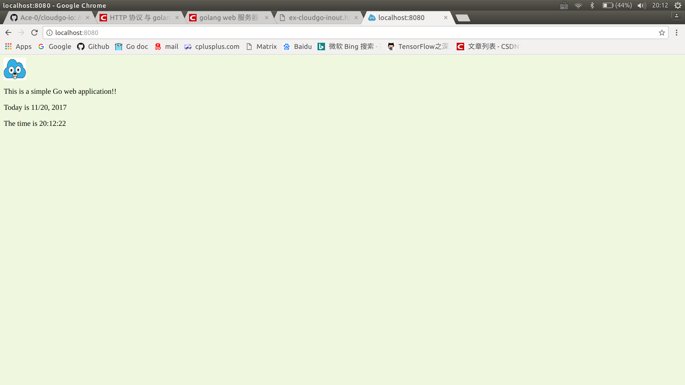
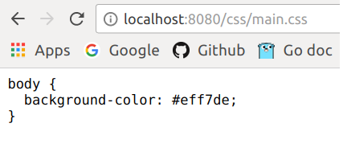
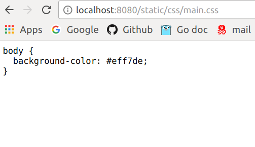
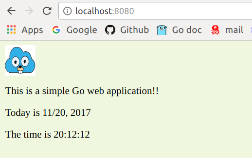
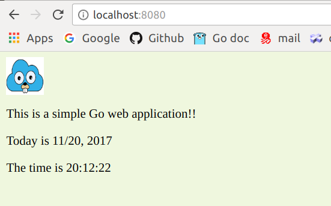
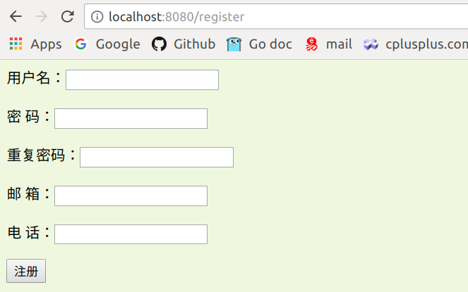
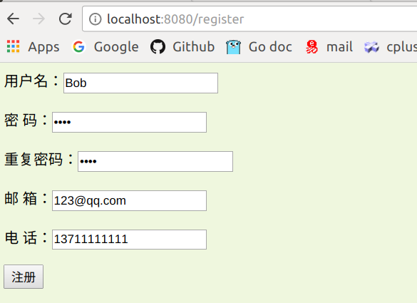
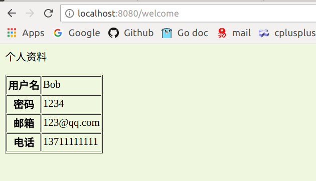
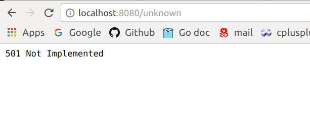

# cloudgo-io

a simple web server

### 基本要求：

基本页面：



1. 支持静态文件服务

   

   

2. 支持简单 js 访问

   利用js获取系统时间，并且每1秒更新一次，实现时钟的效果：

   **clock.js**:

   ```javascript
   $(document).ready(function() {
       setInterval(function() {
         var dateNtime = new Date();
         var year = dateNtime.getFullYear();
         var month = dateNtime.getMonth() + 1;
         var day = dateNtime.getDate();
         var hours = dateNtime.getHours();
         var minute = dateNtime.getMinutes();
         var second = dateNtime.getSeconds();

         var dateStr = month + "/" + day + ", " + year;
         var timeStr = hours + ":" + minute + ":" + second;
         $('.index-date').html("Today is " + dateStr);
         $('.index-time').html("The time is " + timeStr);
       }, 1000)
   })
   ```

   实现效果：

   

   

3. 提交表单，并输出一个表格

   在"/register"页面下进行注册，提交表单：

   

   

   点击"注册"按钮后，跳转到"/welcome"，并在表格中展示数据：

   

4. 对 `/unknown` 给出开发中的提示，返回码 `5xx`

   

   ​
